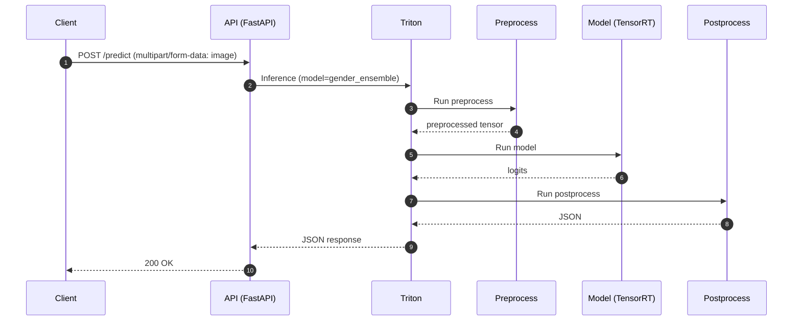

# معماری استقرار سیستم‌های هوش مصنوعی (SE\_FOR\_AI)

**Docker → ONNX → TensorRT → NVIDIA Triton → FastAPI**

> این مخزن، بخشی از تمرین‌های «معماری نرم‌افزار» در دانشگاه شهید بهشتی است.
> هدف: ارائه‌ی یک الگوی مرجع برای *Inference-as-a-Service* با کارایی بالا، جداسازی مسئولیت‌ها، و تکرارپذیری کامل.

---

## فهرست مطالب

* [۱) معرفی و اهداف](#۱-معرفی-و-اهداف)
* [۲) نمای C4 پروژه](#۲-نمای-c4-پروژه)

  * [C1 – Context](#c1--context)
  * [C2 – Container](#c2--container)
  * [C3 – Component](#c3--component)
  * [Sequence – جریان درخواست](#sequence--جریان-درخواست)
* [۳) معماری و اصول طراحی](#۳-معماری-و-اصول-طراحی)
* [۴) پیش‌نیازها](#۴-پیش‌نیازها)
* [۵) راه‌اندازی سریع](#۵-راهاندازی-سریع)
* [۶) پیکربندی‌ها](#۶-پیکربندیها)

  * [متغیرهای محیطی](#متغیرهای-محیطی)
  * [نمونه docker-compose.yml](#نمونه-docker-composeyml)
  * [ساختار مخزن مدل Triton](#ساختار-مخزن-مدل-triton)
  * [نمونه‌های ساده‌ی config.pbtxt](#نمونههای-سادۀ-configpbtxt)
* [۸) ساختار پوشه‌ها](#۸-ساختار-پوشهها)
* [۹) بنچمارک و بهینه‌سازی](#۹-بنچمارک-و-بهینهسازی)
* [۱۰) عیب‌یابی](#۱۰-عیب‌یابی)
* [۱۱) منابع و ارجاعات](#۱۱-منابع-و-ارجاعات)
* [۱۲) مجوز](#۱۲-مجوز)

---

## ۱) معرفی و اهداف

این پروژه یک الگوی مرجع برای استقرار مدل‌های هوش مصنوعی به‌صورت سرویس (*Inference-as-a-Service*) است. هسته‌ی معماری با **NVIDIA Triton** و الگوی **Ensemble** طراحی شده تا سه مرحله‌ی **پیش‌پردازش → اجرای مدل → پس‌پردازش** در سمت سرور کپسوله شود.

**اهداف کلیدی**

* کارایی و توان عملیاتی بالا با **TensorRT**، **Dynamic Batching** و **Concurrent Instances**
* **Separation of Concerns**: ساده‌سازی کلاینت (ارسال تصویر خام)
* تکرارپذیری با **Docker/Compose**
* انعطاف‌پذیری با استاندارد **ONNX** و کاهش **Vendor Lock-in**

---

## ۲) نمای C4 پروژه

### C1 – Context

کلاینت تصویر خام را به API (FastAPI) می‌فرستد؛ Triton یک Ensemble شامل سه جزء Preprocess/Model/Postprocess را اجرا کرده و خروجی JSON تحویل می‌دهد.

```
flowchart LR
  User[کاربر / کلاینت] -->|HTTP: /predict| API[API Gateway (FastAPI)]
  API -->|gRPC/HTTP| TRITON[NVIDIA Triton Inference Server]
  TRITON -->|Ensemble| PIPE[Preprocess → Model → Postprocess]
  PIPE --> JSON[خروجی JSON]
  JSON --> User
```

### C2 – Container

دو کانتینر اصلی: `api` و `triton`. مخزن مدل روی کانتینر Triton مونت شده و ارتباط داخلی از طریق شبکه Compose است.

```
flowchart TB
  subgraph Client
    BROWSER[App/Browser]
  end

  subgraph DockerHost
    subgraph API_Container
      API[FastAPI/Uvicorn<br/>/app/main.py]
    end

    subgraph Triton_Container
      TR[NVIDIA Triton Server]
      MR[(model_repository)]
      GPU((GPU))
    end
  end

  BROWSER -->|HTTP 8080| API
  API -->|gRPC/HTTP| TR
  MR -. mounted .-> TR
  TR -. uses .-> GPU
```

### C3 – Component

سه مؤلفه‌ی Ensemble در Triton:
`gender_preprocess (Python)` → `gender_model (TensorRT)` → `gender_postprocess (Python)`

```mermaid
flowchart LR
  API[API Gateway] -->|/predict| ENS[(gender_ensemble)]
  ENS --> PRE[gender_preprocess (Python)]
  PRE --> CORE[gender_model (TensorRT)]
  CORE --> POST[gender_postprocess (Python)]
  POST --> RESP[JSON نهایی]
```

### Sequence – جریان درخواست



---

## ۳) معماری و اصول طراحی

* **Separation of Concerns**: کلاینت فقط تصویر خام می‌فرستد؛ کل منطق پردازش در سرور.
* **ONNX → TensorRT**: استانداردسازی مدل‌ها و تولید موتورهای بهینه (FP16/INT8).
* **Triton Ensemble**: حذف رفت‌وبرگشت‌های اضافی شبکه؛ افزایش همبستگی مؤلفه‌ها.
* **Dynamic Batching & Concurrent Instances**: افزایش *Utilization* و *Throughput* روی GPU.
* **Docker Compose**: ایزوله‌سازی، تکرارپذیری و استقرار ساده.

---

## ۴) پیش‌نیازها

* **Docker** و **Docker Compose**
* **NVIDIA Driver** و **NVIDIA Container Toolkit** برای GPU در کانتینر
* دسترسی به یک GPU سازگار (**تست**: `nvidia-smi`)

---

## ۵) راه‌اندازی سریع

۱) به پوشه‌ی پروژه بروید:

```bash
cd final
```

۲) سرویس‌ها را بالا بیاورید:

```bash
docker compose up -d --build
```

۳) وضعیت لاگ‌ها:

```bash
docker compose logs -f triton
docker compose logs -f api
```

۴) سلامت Triton:

```bash
curl http://localhost:8000/v2/health/ready
```

۵) تست API (مسیر فایل را تنظیم کنید):

```bash
curl -X POST http://localhost:8080/predict \
  -F "image=@/absolute/path/to/image.jpg"
```

> پورت‌ها: **API** روی `8080`، **Triton** روی `8000/8001/8002` (HTTP/gRPC/Metrics)

---

## ۶) پیکربندی‌ها

### متغیرهای محیطی

| نام               | پیش‌فرض              | توضیح                                        |
| ----------------- | -------------------- | -------------------------------------------- |
| `TRITON_HTTP_URL` | `http://triton:8000` | آدرس HTTP برای Triton                        |
| `TRITON_GRPC_URL` | `triton:8001`        | آدرس gRPC برای Triton                        |
| `TRITON_PROTOCOL` | `grpc` یا `http`     | پروتکل ارتباط API با Triton                  |
| `UPLOAD_DIR`      | `/tmp/uploads`       | مسیر نگه‌داری فایل‌های آپلودی در کانتینر API |
| `MODEL_NAME`      | `gender_ensemble`    | نام مدل در Triton                            |

> اگر از `.env` استفاده می‌کنید، Compose این مقادیر را لود می‌کند.

### نمونه `docker-compose.yml`

> در صورت نیاز نسخه‌ی ایمیج Triton را مطابق CUDA/Driver خود تنظیم کنید.

```yaml
version: "3.9"

services:
  triton:
    image: nvcr.io/nvidia/tritonserver:24.05-py3
    command: >
      tritonserver
        --model-repository=/models
        --http-port=8000
        --grpc-port=8001
        --metrics-port=8002
        --strict-model-config=false
    ports:
      - "8000:8000"
      - "8001:8001"
      - "8002:8002"
    volumes:
      - ./model_repository:/models
    deploy:
      resources:
        reservations:
          devices:
            - capabilities: [gpu]
    environment:
      - CUDA_VISIBLE_DEVICES=0

  api:
    build:
      context: ./app
      dockerfile: Dockerfile
    environment:
      - TRITON_HTTP_URL=http://triton:8000
      - TRITON_GRPC_URL=triton:8001
      - TRITON_PROTOCOL=grpc
      - UPLOAD_DIR=/tmp/uploads
      - MODEL_NAME=gender_ensemble
    ports:
      - "8080:8080"
    depends_on:
      - triton
    volumes:
      - ./app/uploads:/tmp/uploads
```

### ساختار مخزن مدل Triton

```text
model_repository/
├── gender_preprocess/
│   ├── 1/
│   │   └── model.py
│   └── config.pbtxt
├── gender_model/
│   ├── 1/              # (موتور TensorRT یا فرمت پشتیبانی‌شده)
│   └── config.pbtxt
├── gender_postprocess/
│   ├── 1/
│   │   └── model.py
│   └── config.pbtxt
└── gender_ensemble/
    ├── 1/
    └── config.pbtxt    # زنجیره‌ی ورودی/خروجی بین سه جزء بالا
```

> **نکته‌ی نام تنسورها**: در این الگو ورودی Ensemble با نام `IMAGE_BYTES` از نوع `BYTES` با `shape=[1]` و خروجی `OUTPUT_JSON` است. اگر در `config.pbtxt` شما متفاوت است، نام/نوع‌ها را در API هماهنگ کنید.

### نمونه‌های ساده‌ی `config.pbtxt`

**۱) پیش‌پردازش (Python Backend)**

```protobuf
name: "gender_preprocess"
backend: "python"

input [
  { name: "IMAGE_BYTES", data_type: TYPE_STRING, dims: [1] }
]
output [
  { name: "IMAGE_TENSOR", data_type: TYPE_FP32, dims: [3,224,224] }
]

instance_group [{ kind: KIND_GPU }]
```

**۲) مدل (TensorRT)**

```protobuf
name: "gender_model"
platform: "tensorrt_plan"

input [
  { name: "INPUT__0", data_type: TYPE_FP32, dims: [3,224,224] }
]
output [
  { name: "LOGITS", data_type: TYPE_FP32, dims: [2] }
]

instance_group [{ kind: KIND_GPU, count: 1 }]

dynamic_batching {
  preferred_batch_size: [1, 2, 4, 8]
  max_queue_delay_microseconds: 2000
}
```

**۳) پس‌پردازش (Python Backend)**

```protobuf
name: "gender_postprocess"
backend: "python"

input [
  { name: "LOGITS", data_type: TYPE_FP32, dims: [2] }
]
output [
  { name: "OUTPUT_JSON", data_type: TYPE_STRING, dims: [1] }
]

instance_group [{ kind: KIND_GPU }]
```

**۴) Ensemble**

```protobuf
name: "gender_ensemble"
platform: "ensemble"

input [
  { name: "IMAGE_BYTES", data_type: TYPE_STRING, dims: [1] }
]
output [
  { name: "OUTPUT_JSON", data_type: TYPE_STRING, dims: [1] }
]

ensemble_scheduling {
  step [
    {
      model_name: "gender_preprocess"
      model_version: -1
      input_map { key: "IMAGE_BYTES" value: "IMAGE_BYTES" }
      output_map { key: "IMAGE_TENSOR" value: "IMAGE_TENSOR" }
    },
    {
      model_name: "gender_model"
      model_version: -1
      input_map { key: "INPUT__0" value: "IMAGE_TENSOR" }
      output_map { key: "LOGITS" value: "LOGITS" }
    },
    {
      model_name: "gender_postprocess"
      model_version: -1
      input_map { key: "LOGITS" value: "LOGITS" }
      output_map { key: "OUTPUT_JSON" value: "OUTPUT_JSON" }
    }
  ]
}
```

---

## ۷) API

**مسیرها**

* `GET /` : صفحه‌ی ساده برای آپلود تصویر
* `GET /health` : سلامت API و اتصال به Triton
* `POST /predict` : دریافت تصویر و برگرداندن خروجی JSON

**بدنه‌ی درخواست**
`multipart/form-data` با کلید `image`

**پاسخ نمونه**

```json
{
  "gender": "female",
  "score": 0.97
}
```

**نمونه‌ی تست**

```bash
curl -X POST http://localhost:8080/predict \
  -F "image=@/path/to/your.jpg"
```

> **پروتکل به Triton**: با متغیر `TRITON_PROTOCOL` بین `grpc` و `http` سوییچ کنید.

---

## ۸) ساختار پوشه‌ها

> خلاصه‌ای از ساختار واقعی پروژه شما

```text
final/
├── app/
│   ├── main.py
│   ├── static/
│   └── templates/
│       ├── index.html
│       └── design.html
├── model_repository/
│   ├── gender_preprocess/
│   ├── gender_model/
│   ├── gender_postprocess/
│   └── gender_ensemble/
├── tutorials/
│   ├── Part_1-model_deployment/ ...
│   ├── Part_2-improving_resource_utilization/ ...
│   ├── Part_3-optimizing_triton_configuration/ ...
│   └── Part_8-semantic_caching/ ...
├── Deployment/
│   └── Kubernetes/ (EKS, Autoscaling, Multi-Node, ...)
├── Quick_Deploy/ (vLLM, PyTorch, ONNX, TensorFlow, HuggingFace ...)
├── Triton_Inference_Server_Python_API/ (examples, kafka-io, rayserve, ...)
└── README.md
```

---

## ۹) بنچمارک و بهینه‌سازی

**Warmup**
پس از بالا آمدن سرویس، چند درخواست تست ارسال کنید تا مدل‌ها به‌صورت کامل بارگذاری شوند.

**Dynamic Batching**
در `config.pbtxt` مقادیر `preferred_batch_size` و `max_queue_delay_microseconds` را بر اساس بار تنظیم کنید.

**Concurrent Instances**
با `instance_group` تعداد نمونه‌های موازی مدل را افزایش دهید (تا جایی که حافظه‌ی GPU اجازه می‌دهد).

**Precision**
در صورت امکان موتورهای `FP16/INT8` بسازید (با `trtexec` یا APIهای TensorRT) برای کاهش تأخیر.

**Monitoring**
پورت `8002` (Prometheus) را به Grafana وصل کنید؛ نمودارهای *Latency/Throughput/GPU Utilization* را پایش کنید.

**ابزار پروفایلینگ Triton**
از لاگ‌ها و متریک‌ها برای شناسایی گلوگاه‌های پیش/پس‌پردازش استفاده کنید. (در صورت موجود بودن، از `perf_analyzer` برای ارزیابی نرخ عبور و تأخیر بهره بگیرید.)

---

## ۱۰) عیب‌یابی

### GPU در کانتینر دیده نمی‌شود

* نصب `nvidia-container-toolkit` را بررسی کنید.
* تست سریع:

  ```bash
  docker run --rm --gpus all nvidia/cuda:12.3.2-base-ubuntu22.04 nvidia-smi
  ```

### خطا در بارگذاری مدل

* ساختار نسخه‌دهی (`1/`) و مسیر `model_repository` را بررسی کنید.
* لاگ Triton:

  ```bash
  docker compose logs -f triton
  ```

### عدم انطباق نام/نوع تنسورها

* ورودی/خروجی‌های `config.pbtxt` را با کلاینت (API) هماهنگ کنید (به‌ویژه نام‌های `IMAGE_BYTES`، `IMAGE_TENSOR`، `INPUT__0`، `LOGITS`، `OUTPUT_JSON`).

### زمان پاسخ اولیه زیاد

* Warmup اجرا کنید؛ بعضی مدل‌ها زمان آماده‌سازی بیشتری دارند (بارگذاری وزن‌ها، ساخت موتور، …).

---

## ۱۱) منابع و ارجاعات

* Fang, J., Liu, Q., & Li, J. (2021). *A Deployment Scheme of YOLOv5 with Inference Optimizations Based on the Triton Inference Server*. ICCCBDA.
* Zhou, Y., & Yang, K. (2022). *Exploring TensorRT to Improve Real-Time Inference for Deep Learning*. HPCC.
* Völter, C., Koppe, T., & Rieger, P. (2024). *Benchmarking DNNs Inference Performance before Development*. HICSS-57.
* Romero, F., Li, Q., Yadwadkar, N. J., & Kozyrakis, C. (2021). *INFaaS: Automated Model-less Inference Serving*. USENIX ATC.
* Gujarati, A., et al. (2020). *Serving DNNs like Clockwork: Performance Predictability from the Bottom Up*. OSDI.

**کلیدواژه‌ها**: Scalability, Inference-as-a-Service, Decoupling, Docker, Warmup, Optimization Chain, Interoperability, Quantization, Toolchain, Separation of Concerns, Loose Coupling, Vendor Lock-in, Dynamic Batching, High Cohesion

---


### پیوست: نکات اجرایی برای Python Backend (اختیاری)

* در `model.py` های Python Backend، کتابخانه‌های موردنیاز را *داخل ایمیج Triton* نصب یا در پوشه‌ی مدل *vendor* کنید (به‌ویژه هنگام عدم دسترسی اینترنت).
* برای ورودی `TYPE_STRING` شامل تصویر، در پیش‌پردازش تبدیل بایت‌ها به `np.float32` نرمال‌شده با شکل `[3, H, W]` را انجام دهید تا دقیقاً با ورودی مدل هم‌خوان شود.
* اگر از `strict-model-config=false` استفاده می‌کنید، پس از تثبیت تنظیمات، آن را **true** کنید تا خطاهای ناهمخوانی زودتر آشکار شوند.

